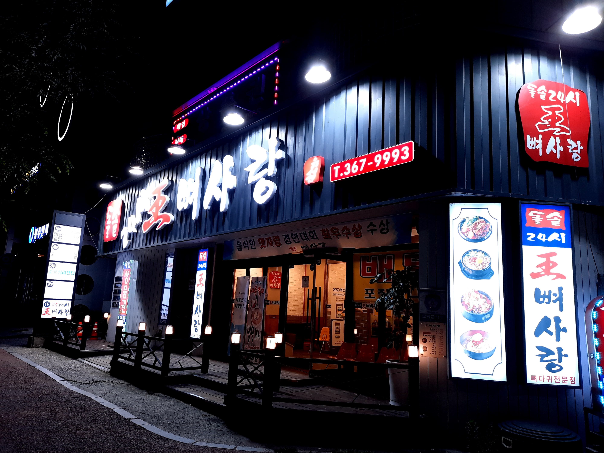
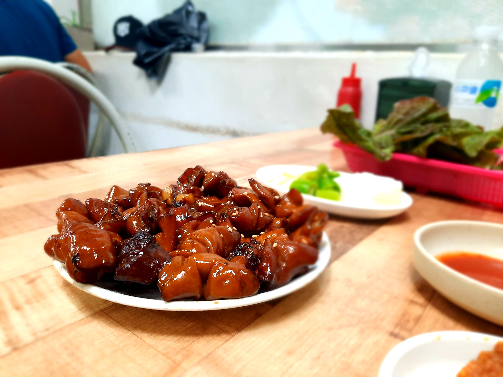
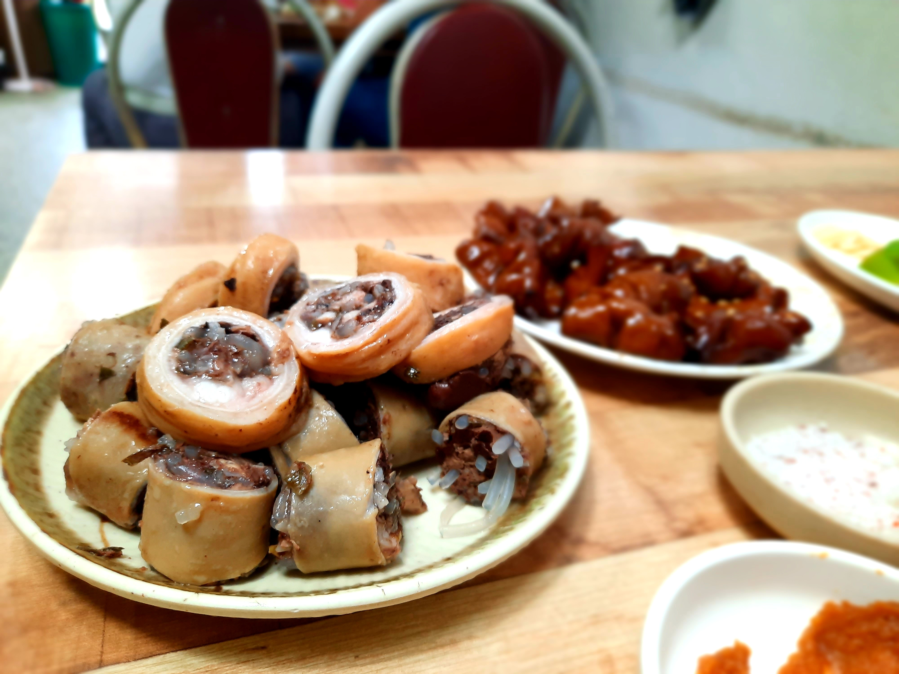
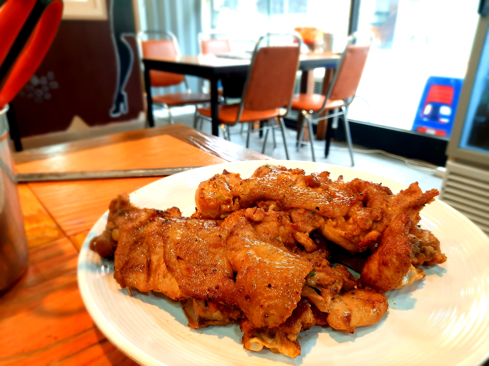
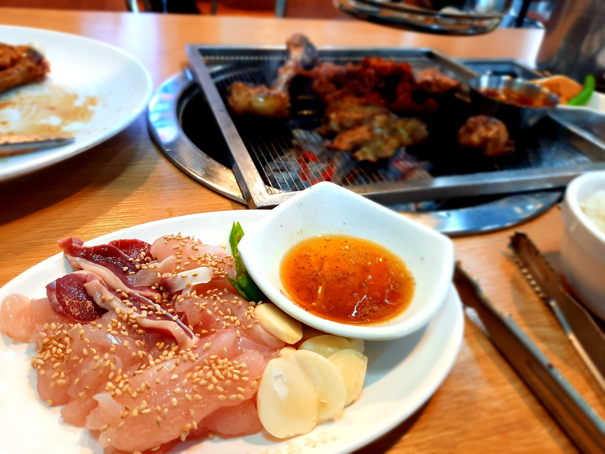

## Intro
다른 모든 것을 제쳐두고, 이번 여행은 오직 닭사시미뿐이다. 작년부터 먹어보고 싶다고 생각은 해왔는데, 음식 하나를 위해 먼 거리를 다녀오는 건 내겐 어려운 일이었다. 특히 울산-광주는 갈 방법이 버스 외엔 딱히 없고. 그러다 우연히 지텔프(G-TELP)를 볼 기회를 얻었는데, 마침 시험이 울산에서 열리질 않아, 시험도 볼 겸, 닭사시미도 먹을 겸 주말을 끼고 광주로 향했다. 지텔프가 대충 5-6만 원 근처로 알고 있는데, 교통비만 8만 원이 나온 걸 생각하면 역시 자기 합리화로 시작한 여행이다... 

늘 우등 버스만 타다 이번엔 프리미엄 버스를 타봤는데, 제법 승차감이 좋다. 특징이라면 역시 어딘가 애매하게 가려주는 커튼과 별로 쓸 일은 없어보이는 태블릿. 차 안에서 콘센트를 바라는 건 무리겠지? 노트북 배터리가 다 닳을 떄까지 메이플만 하다가 잤다.

## 유스퀘어 근처: 왕뼈사랑
유스퀘어에 도착할 때 대충 11시 반 정도가 되었다. 다이어트를 안하더라도 야식은 꺼리는 편인데, 여행이라 그런지 고삐가 풀려서 열심히 먹을 걸 찾았다. 마침 예전에 인스타그램에서 본 등뼈탕 집이 생각났는데, 그곳이 마침 유스퀘어 근처였다. 

심지어 24시간 영업이다!

단돈 만 원에 나오는 한 상이다. 등뼈가 정말 크다. 위에서 찍어 잘 보이진 않지만, 등뼈가 깊이 박혀 있음에도 뚝배기 높이의 두 배는 솟아있다. 뼈뿐만 아니라 살점도 푸짐하게 박혀 있어, 고기-밥-국물 밸런스를 생각하지 않고 팍팍 먹어줘도 괜찮다. 옆 테이블들을 슬쩍 보는데 다 소주를 끼고 있다. 충분히 이해가 가는 곳이다.

등뼈에서 살을 발라내느라, 그리고 돌솥밥에서 누룽지를 박박 긁어내느라 손이 힘들었다. 보람찬 노동을 했지만 손만 아파서 운동은 당연히 안 됨...

## 송정역 근처: 서울곱창
광주 맛집을 찾아보고 있을 때, 간장에 졸인 듯한 비주얼을 가진 곱창 구이를 여럿 보았다. 그래서 여행의 메인은 아니지만, 꼭 먹어보기로 다짐했었다. 마침 장마가 시작하는지, 정말 억세게 비가 내렸다. 신발이고 양말이고 다 젖어서 조금 서러웠다. 곱창이 별로라면 더 서러웠을 것이다.

한 접시에 17,000원이다. 싼 가격은 아니지만, 그래도 곱창은 빨리 물리는 음식임을 감안하면 그렇게 비싼 가격도 아닌 듯. 

맛은 비에 홀딱 젖은 서러움을 달래주기에 충분했다. 간장 양념의 느낌이 곱창의 느끼함을 잘 잡아준다. 마늘과 고추 하나씩 올려놓고 한 쌈 먹으면 정말 기가 막힌다. 하지만 야채로 배를 채우기 너무 아까워서 나중엔 곱창만 계속 집어 먹었다. 느끼함을 덜 타는 내 입맛에게 너무 고마운 날이었다.

곱창을 반 정도 먹었을 때, 배가 덜 차리라는 예감이 들어 추가로 암뽕순대를 주문했다. 12,000원이었던 걸로 기억한다.

도톰하고 쫄깃한 막창에 선지가 가득 채워졌다. 처음엔 선지를 비롯한 순대소의 맛이 입안 가득 퍼지는데, 그러고 나면 암뽕만이 남아 그 특유의 쫄깃함을 계속 즐길 수 있다.

일반 분식점 순대는 별 영양가 없이 밋밋하기만 해서 기피 음식 중 하나인데, 이런 순대는 두 팔 벌려 환영이다. 두 메뉴 다 소주를 부르는 음식이다. 다른 사람이랑 왔으면 먹었을지도?

## 상무지구 근처: 상추튀김
나는 튀김을 좋아하는데, 정말 그 튀김 자체만을 좋아해서, 그 내용물엔 사실 큰 관심이 없다. 그 튀김옷의 아삭하고 기름진 느낌을 즐기는 편이다. 사람들이 내가 광주 간다고 했을 때 상추튀김 이야기를 한 번은 꼭 했는데, 이런 나라서 크게 기대는 안했지만, 그래도 경험 삼아 상추튀김을 먹으러 갔다.

상추튀김을 찾으니 무언가 엄청 나오는데, 맛이 다 비슷하겠거니 해서 그냥 눈 앞에 보이는 곳으로 들어갔다.

메뉴판을 보자마자 약간 낚였다는 생각이 들었다. 상추를 튀긴 게 아니라, 튀김을 상추쌈에 싸서 먹는 것이었다. 네이버를 보니 모두가 한 번은 그렇게 낚였다는 것 같다. 나도 범인의 영역에 있었던 것인가...

나는 돼지고기 튀김과 함께 먹었는데, 제법 괜찮은 맛이었다. 쌈에 올리는 간장 양념도 잘 어울리고, 상추가 느끼함을 잘 잡아준다. 다만 튀김옷 러버인 내 마음엔 도달하지 못했다. 

## 첨단지구 근처: 참숯불에꾸운닭
드디어 닭사시미를 먹으러 간다. 사실 닭사시미가 메인은 아니고, 사이드 정도로 내어 주는 모양이다. 나는 토종닭 숯불구이를 시킬 예정이다. 35,000원 정도 했던 것 같다. 광주에만 지점이 여럿 있는데, 점심에 여는 곳은 여기뿐인 것 같다. 혹시 몰라 전날에 닭사시미가 나오는지 전화로 확인까지 했다. 

아침에 듀얼하는 데 정신이 팔려 버스를 반대 방향으로 타는 바람에, 예약 시간을 맞추기 위해 택시를 열심히 탔다. 내 돈, 내 멘탈...

매장이 엄청 넓다. 심지어 매장 문을 연 지 얼마 되지 않은 때 들어와서 넓은 방에 나 홀로 앉아 있었는데, 심지어 4인 테이블을 나 혼자 쓰고 있자니 약간 무안했다. 기본 반찬을 내어주시는데, 반찬 하나하나가 제법 맛있다. 특히 닭죽은 고기도 넉넉히 들어있고, 닭 육수 사이로 살짝 나는 후추향이 마음에 든다.

드디어 고기가 나왔다. 김이 스멀스멀 나는 걸 보니, 초벌을 해서 나온 것 같다. 토종닭이라 그런지 반 마리를 시켰음에도 양이 엄청나다. 북채를 보고 이를 크게 체감했는데, 무슨 칠면조를 보는 줄 알았다. 

구워서 먹어보면, 토종닭 특유의 탄력을 느낄 수 있다. 가슴살도, 다리살도, 심지어 껍데기까지도 다. 나는 부드러우면서 쉽고 부서지고 뭉개지는 일반 닭보단 이런 닭이 더 좋더라, 물론 주면 안 가리고 다 잘 먹지만. 식감도 식감이지만, 숯불구이 특유의 간장양념도 무척 마음에 든다. 깊게 배었음에도 향이 너무 진하지는 않아 닭 맛을 해치지 않는다. 이 적당함이 내겐 아주 중요한데, 그러지 못한 싸구려 돼지갈비를 싫어하는 이유이기도 하다. 

아무튼, 이게 이 여행의 본 목적이다. 아주 조금 담겨져 나오는, 이 한 접시가 말이다. 먹은 순간은 몇 분 되지 않음에도, 마음에 품은 기간이 너무나도 길었기에 그 감회가 남다르다. 

하얀 살은 닭가슴살이고, 붉은 살은 아마 모래주머니인 것 같다. 확실하진 않은데 식감을 생각할 땐 대충 맞는 것 같다. 점원분께 물어보고 싶었지만, 사회성 레벨 0이라 미처 말을 걸지 못했다... 닭가슴살은 익힐 땐 그렇게 뻑뻑하면서, 사시미로 먹으면 그렇게 쫄깃할 수가 없다. 잡내도 하나도 나지 않아, 마치 신선한 생선회를 먹는 기분이다. 회는 잘 몰라서 빗댈 회가 없지만. 모래주머니는 식감이 무척 재미있다. 살짝 씹으면 오도독 소리가 나는데, 익힌 걸 먹을 때와 비슷한 소리가 나서 어쩐지 반갑다. 

참고로 이에 더해 닭발까지 서비스로 주셨는데, 코스 요리가 따로 없었다. 닭을 다양하게 즐길 수 있는 시간이었다. 토종닭이 다 그렇듯, 가격은 조금 나까지만, 하나도 아깝지 않은 곳.

## 마치며
이번 여행은 먹는 것에만 집중해, 관광지 구경이나 액티비티엔 전혀 시간을 쓰지 않았다. 다행이었던 게, 마침 여행 내내 비가 엄청 쏟아져서, 관광지를 다녔다면 굉장히 서러웠을 것이다. 가만 생각해보면 여러모로 운이 좋다.

광주 맛집으로 소개된 곳을 여럿 보았는데, 이제 음식 투어를 위한 장소로는 더 이상 미련이 없을 듯 하다. 다음 음식은 아마 우랑탕이 될 것 같다. 우랑탕으론 영천이 유명한 것 같더라. 시간적 여유가 생기면 꼭 가봐야지.