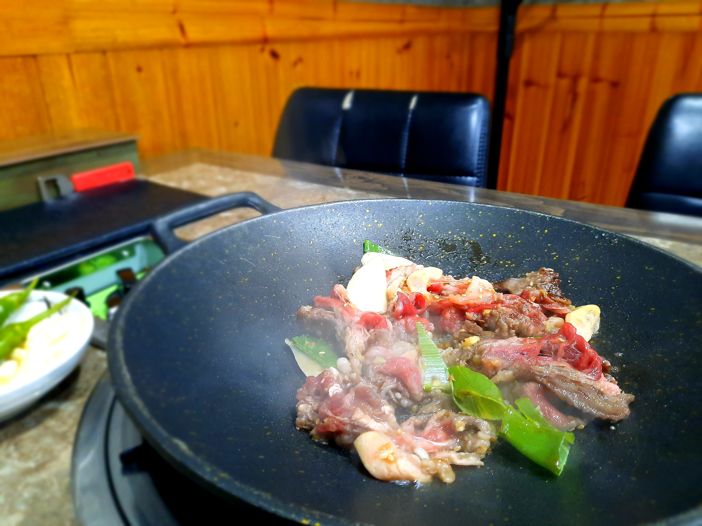
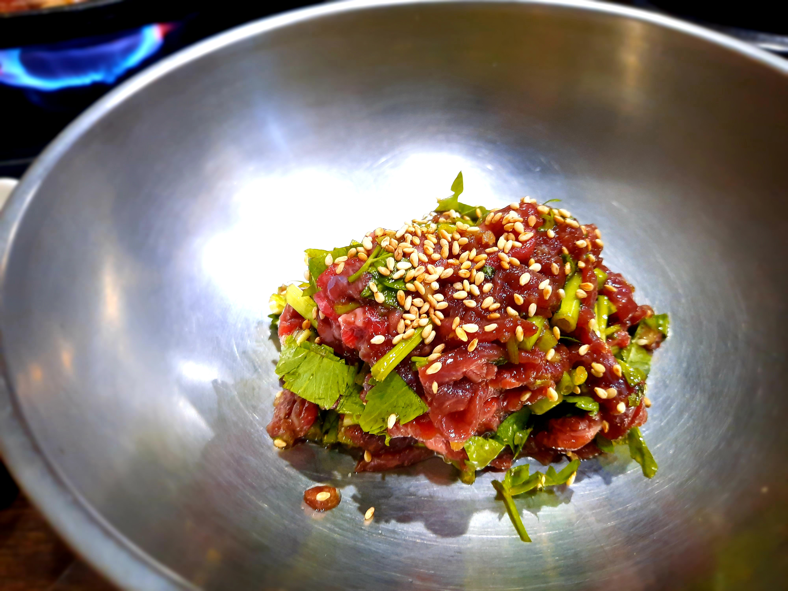

## 우랑탕만을 위한 여행
늘 새로운 경험에 집착하는 나는, 몇 달 전부터 우랑탕을 먹어보리라 다짐했다. 지난 주 갔던 광주에서도 우랑을 취급하는 식당이 있대서 겸사겸사 들러볼까 했지만, 마침 내가 간 날에 재료가 다 떨어져서 결국 먹어보지 못했다. 그게 미련으로 남았지만 음식 하나를 위해 관광지를 다시 방문하기엔 조금 과한 감이 있어, 우랑탕을 파는 다른 곳을 찾아보기로 했다. 그렇게 나온 곳이 경북 영천의 "포항할매집"이다. 네이버에서 찾아봐도 이 집이 압도적으로 리뷰가 많고, 매장 자체도 꽤 유명한 것 같았다.

다만, 아무리 찾아봐도 영천엔 내 마음을 끄는 관광 아이템은 없는 것 같았다. 문화/역사 관광지는 내 정서에 안 맞고, 계곡이나 댐, 산을 돌아다니기엔 장마와 더위가 무섭다. 그나마 짚라인에서 조금 고민하긴 했지만, 짚라인은 생각보다 탈 곳이 많기도 하거니와, 동선이 너무 꼬여져서 이마저도 포기했다. 당일치기로 밥만 먹고 내려오는, 그야말로 우랑탕만을 위한 여행이다.

## 우랑탕을 찾아
새벽에 울산에서 출발해 아침 9시 정도에 터미널에 도착했다. 여행 목적이 확실하므로 지체 없이 영천공설시장으로 향했다. 

영천공설시장은 버스터미널이나 영천역에서 몇 분 걸으면 나오는 전통시장이다. 규모가 꽤 크기도 하고, 취급하는 품목도 다양하다. 건어물이나 돔배기만을 다루는 골목이 있는가 하면, 곰탕을 주로 파는 곰탕골목도 있다. 전날 저녁 이후로 아무 것도 입에 뭘 넣지 않아 배고픈 상태지만, 더 맛있게 우랑탕을 먹기 위해 시장 주변을 1시간 정도 돌아다녔다.

상대적으로 시골이라 그런지 시장가에 다방이 즐비하게 들어서 있다. 간판을 봤을 때 별로 건전해보이지는 않는다. 그 외에도 유사 업소가 많은 걸 보면, 예전에 봤던 농촌에서의 성매매 이슈가 사실이었다는 걸 느낀다. 문제는 커피 한 잔 마시려고 지도 앱에서 카페를 찾으면 다방들도 같이 잡혀버린다는 점이다. 대놓고 "다방" 키워드가 붙으면 먼저 거를 수 있는데, 상호명이 "-카페"와 같이 되어 있으면 직접 가보지 않고는 모른다. 덥고 목말라 죽겠는데 이걸로 세 번은 낚여서 조금 짜증이 났다.

아무튼 카페에서 목을 좀 축이다 우랑탕을 먹으러 나왔는데, 생각보다 길을 찾기가 어려웠다. 지도에 내 모든 걸 맡기는 나인데, 지도에서 시장 내부 구조가 잘 드러나질 않았다. 그렇게 시장을 반강제로 한 바퀴 더 돌았는데, 걸으면서 골목마다의 특유의 냄새를 느낄 수 있었다. 건어물을 취급하는 곳에선 묘하게 비릿하고 고약한 냄새가, 식당가에는 온갖 음식들이 뒤섞인 냄새가, 곰탕골목엔 특유의 국밥 냄새가.. 하지만 뭐니 뭐니 해도 역시 시장가에서 가장 좋은 냄새는 방앗간에서 난다. 마침 한 아저씨가 기름을 소주병에 따르고 있는데, 참기름 냄새가 내 코 깊숙이 들어와 내 코마저 기름지게 만든다. (원래 지성이다) 어릴 때 우리 집도 시골집에 내려가면 참기름을 소주병에 담은 걸 한 두 병 받아오곤 했는데, 그래서인지 참기름이나 들기름은 소주병에 들어있어야 제 느낌이 나는 것 같았다. 기름이다보니 요리할 때 잘 안 넣어 먹지만, 이렇게 냄새를 맡고 있자면 괜히 한 병 정도는 사가고 싶어진다. 

길을 헤매고 헤매다 마침내 포항할매집에 도착했다. 곰탕골목 안쪽에 있는데, 그 곰탕골목을 찾기가 너무 어려웠다. 

식당 건물이 여러 개인 것 같다. 처음 앞에 왔을 때 같은 이름의 간판이 여러 개길래 어디로 가야하나 고민을 했는데, 점원분들이 다 같은 유니폼을 입은 걸 보고 다 같은 집이라는 걸 깨달았다. 장사가 잘 되나보다.

점원분들이 전반적으로 친절했던 걸로 기억한다. 내가 들어오니 에어컨도 틀어 주시고, 주문 전에 몇 마디 소소히 나누었는데, 그 친절함을 몸소 느낄 수 있었다. 아무튼 이 여행의 목적인 우랑탕 하나(9,000원)와, 소 모둠수육 소자(15,000원)를 주문했다. 혼자 수육 하나를 먹는 건 좀 과하지 않나 싶긴 하지만, 그렇다고 우랑탕 하나만 먹기엔 너무 아쉽다.

먼저 모둠수육이 나왔다. 난 국밥집 수육을 무척 좋아하는데, 보통 이렇게 부위가 다양한 모둠수육으로 나오기도 하고, 가격에 비해 양도 제법 괜찮은 편이기 때문이다. 또, (삼겹살같은) 일반 수육은 집에서도 해 먹을 수 있지만, 이런 부위를 집에서 직접 손질하고 삶기엔 너무 부담이 크기도 하고. 정작 국밥을 별로 안 좋아해서 국밥집에 잘 안 가는 게 유머다. 국밥을 싫어하는 건 아닌데, 국이나 탕류를 즐겨 먹는 편이 아니다보니...

수육은 겨자 소스에 찍어 먹거나, 쌈무에 싸 먹으면 된다. 쌈무가 조금 특이한데, 와사비 향이 꽤 뚜렷하고, 그 두께가 어느 정도 편차가 있는 걸 보아 일반 시제품은 아닌 듯하다. 무 식감이 타 쌈무에 비해 더 잘 느껴져서 내겐 만족스럽다. 느끼함도 많이 줄고. 

그리고 이어서 우랑탕이 나왔다. 건더기가 다 가라앉아 사진에선 보이진 않는데, 생각보다 양이 푸짐하다. 하지만 우랑탕인 것 치고는 우신이 메인인 것 같다. 흠. 아무렴 어때.

이름과 재료가 주는 거부감과 달리, 생각보다 무난한 맛이다. 막 역겨운 맛이 나는 것도 아니고, 적당히 쫄깃하고 부드러우며 곰탕 안에서 확 튀는 맛도 아니다. 오히려 너무 무난한 맛이어서 조금 놀랐다. 가장 비슷한 맛과 식감을 꼽으라면, 우족과 도가니 사이의 어딘가쯤 될 것 같다.

수육도, 우랑탕도 맛있게 먹었다. 사실 이거 먹고 바로 돌아가도 무방했는데, 울산으로 돌아가는 버스가 저녁에만 있어 저녁까지 먹고 돌아가기로 했다. 지금 생각해보면 시간이 조금 더 걸리더라도 조금 더 자주 가는 동대구로 갔다가 KTX 타고 울산으로 돌아갈 걸 그랬다.

## 혼밥의 끝은 고깃집
원래부터 어디든 안 가리고 혼밥을 해왔으나, 역시 혼밥 난이도가 가장 높은 곳은 고깃집이다. 고깃집은 아예 1인 식사를 못하는 곳이 생각보다 많다. 1인 손님은 세팅에 대한 비용에 비해 많이 먹지 않아서 그런 것 같다. 그렇다고, 들어가면서 "저 N인분 먹을 건데요!" 할 수도 없는 노릇이고, 혼밥 가능 여부를 연락해보지 않는 한 미리 알기도 어렵다. 이쯤되면 부끄러움 따위는 있지도 않으며 고려대상도 안되지만, 이런 일은 종종 혼밥을 어렵게 만드는 요인이 된다.

아무튼, 별 이유는 없지만 갑자기 소고기가 먹고 싶어 아무 고깃집이나 찾아갔다. 내가 간 곳은 "화평대군"이라는 매장인데, 버스 터미널 근처에 있는 데다가 매장이 크고 리뷰도 괜찮아서 이곳으로 결정했다.

여기도 점원분들이 다 친절해 기분이 꽤 괜찮았다. 매장 고르는 실력이 좋아진 것 같다. 원래 양념육은 고기로 잘 안쳐주는 편이지만, 오늘따라 달콤짭짤하게 먹고 싶어 소주물럭 2인분(18,000원/150g)과 육회비빔밥(17,000원)을 주문했다. 원래 고기만 3-4인분 시키고 공기밥만 먹으려 했지만, 이곳 육회가 유명하다더라.

먼저 나온 소주물럭이다. 내가 양념육을 안 좋아하는 건 가끔 양념 맛이 튀는 애들이 고기 맛을 씹어버려서 그런데, 여긴 그러지 않아 제법 마음에 들었다. 다만 300g은 너무 적은 양이었던 것 같다. 평소 한 근은 먹는 걸 생각하면 당연한 일인데, 그랬다간 내 지갑이 눈물을 흘렸을 것이다. 꼴에 다이어트 중이라 많이 먹는 게 신경 쓰이기도 하고.

마지막으로 육회비빔밥...에 쓸 육회다. 전용 양념장과 재래기가 있어 거기에 비벼먹으면 되긴 한데, 나는 육회비빔밥은 밍밍하게 먹는 걸 좋아해서, 재래기만 대충 넣어 비벼 먹었다. 비비기 전에 육회를 몇 점 집어 먹었는데, 왜 육회로 유명한지 알 것 같다. 육회를 따로 2인분 정도 시킬걸 하고 후회가 된다.

하지만 비빔밥은 비빔밥 나름의 매력이 있었다. 고기도 고기지만, 잘게 썰어진 미나리가 향긋했다. 같이 나오는 된장찌개와 같이 먹으면 그만한 성찬이 없다. 가끔씩 소주물럭도 함께 먹어주면 더더욱 좋고.

## 마치며
정말로 아무 것도 안하고 먹기만 하고 내려왔다. 하지만 딱히 미련이나 아쉬운 건 없고, 오히려 이렇게 가볍게 다녀오는 것도 꽤 괜찮다는 걸 배웠다. 예전엔 여행에서 뭘 해야 한다는 내적인 압박이 어느 정도 있었는데, 그게 오히려 여행의 만족도를 떨어뜨리는 원인이 될 수도.

그나저나 이젠 더 도전해 볼 음식이 별로 남지 않았다. 이게 메타인지마냥 뭘 안 먹어봤는지를 알기가 어렵기 때문인 것 같다. 가끔씩 고민해보고 다음 목적지를 찾아야지.

