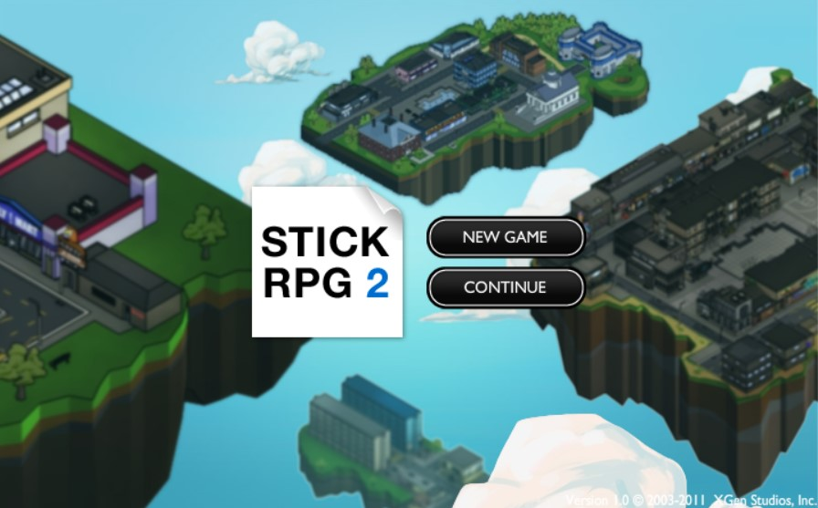
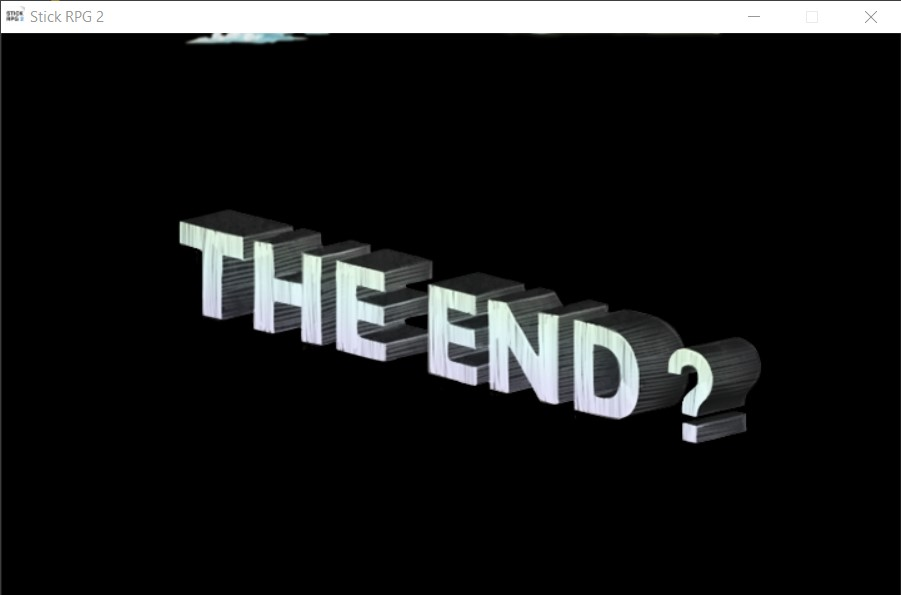
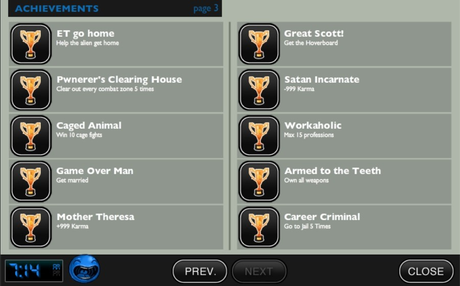

결론부터 말하면, 내가 가장 좋아하는 종류의 게임, 그리고 그 중에서도 가장 즐겁게 했던 게임 중 하나다. 내가 하는 게임들은 그 성격이 다 비슷하다. 다 하나의 작은 세계에서, 하나의 작은 인생을 사는 그런 종류의 게임들이다. 요즘 뜨는 메타버스와 어느 정도 관련이 있을지도. 아무튼, 이건 게임에서 보람 비슷한 걸 느끼고자 하는 성향이 반영된 게 크다. 많은 시간을 투자했던 메이플, 로스트아크 등도 다 그런 맥락이고, 초등학생 때부터 RPG류나 돈 모으는 플래시 게임같은 걸 했단 점을 생각하면 이 성향은 꽤 오래 이어져 온 것 같다.

이제 플래시 플레이어 지원이 완전히 끝난 셈인데, 관련 소식을 들으며 내가 해온 게임들에 대해 생각해봤다. 너무나도 유명한 전쟁시대, 풍선 타워 디펜스(Bloons TD), 그 외 많은 작가들이 만든 자작 게임과 애니메이션(중간에 갑자기 끝나버린 옹디딩은 아직도 생각난다) 등, 초등학생 시절의 즐거움은 대부분 플래시와 함께 했다고 해도 과언이 아니다. 아무튼, 이러한 상황에서의 추억 보정과, 내가 가장 좋아하는 장르, 그리고 플래시가 사장된 지금 Steam에서 별도의 게임으로 판매하고 있다는 점이 잘 맞아 떨어져 오랜만에 플레이했다.

Stick RPG 2는 나온 지 거의 10년은 지난 게임이다. 어릴 떄도 재밌게 플레이했지만, 그 떈 영어를 전혀 읽지 못해, 마을을 돌아다니며 돈과 아이템을 얻고 (당연히 용도조차 잘 몰랐다) 싸우는 것 밖에 할 줄 몰랐었다. 이제 영어 읽는 데 부담이 없으니, 이 게임을 더 재밌게 즐길 수 있을 거라 생각했다.

나는 게임 리뷰어가 아니므로 게임에 대한 디테일한 설명은 하지 않는다. 다만 내가 이 게임의 매력이라고 생각하는 점들을 꼽아보자면,

- **높은 완성도와 풍부한 컨텐츠.** 플래시 게임 치고 완성도가 굉장히 좋다. 외적인 요소론 선명한 그래픽과 부드러운 애니메이션, 풍부한 BGM이 여기에 기여하는 것 같다. 또, 내부적으론 각종 서브 퀘스트와 다양한 종류의 게임 시스템, 그리고 (특히 직업 활동에서의) 기믹 등이 풍부하게 포함되어 있어서, 네 덩어리의 좁은 맵임에도 컨텐츠가 부족하다는 생각이 들지 않는다. 
- **재치있는 밈 사용 및 대사 선정.** 가만히 읽어보면 웃긴 구석이 굉장히 많다. ATM기에서 비밀번호를 입력하는 부분도 그렇고, 일을 끝내고 나오는 결과를 읽어봐도 그렇고. 10년이 지난 게임임에도 낡거나 구리다는 느낌이 전혀 들지 않았다. EH...CLOSE ENOUGH.
- **카르마(Karma) 시스템.** 선악에 따라 직업을 포함하여 여러 개의 분기가 갈린다. 각종 퀘스트나 직업 활동, 할 수 있는 일 등이 카르마의 영향을 받고, 카르마에 영향을 준다. 물론 이 시스템이 여기가 유일하지는 않겠지만, 스탯의 신선함과 실제로 자주 활용된다는 점에서 인상 깊었다.
- **지루하지 않은 배틀 시스템.** 이 게임에선 2D 탑뷰 시점으로 배틀을 진행하는데, 다양한 무기 선택이 가능하고, 다양한 구조의 아레나에서 전투를 수행하게 된다. 또한 맨손 격투, 체인소(chainsaw) 배틀, 1:N 등 여러 배틀 양상이 있다보니, 게임 중 배틀을 여러 번 하게 되지만 지루하다는 생각은 들지 않는다. 고정 체력으로 인해 난이도 조절이 적당히 되어 있다는 점도 한 몫 하는 것 같다. 물론 둠즈데이나 레일건을 얻으면 그런 건 없지만.

참고로 엔딩 분기가 있는데, 후속작을 암시하며 게임을 끝내는 루트, 타임 루프로 스탯을 유지한 채 다시 시작하는 루트, 그리고 전작인 Stick RPG 1 (이것도 재미있게 했었다)으로 넘어가는 루트를 마지막에 고를 수 있다. 이걸 모르고 저장을 안 한 채로 게임을 끝내버려서 업적을 쌓을 때 고생을 좀 했다.

클리어 자체는 어렵지 않은데, 업적이 조금 까다로운 게 많다보니 여러 번 루프를 탔다. 특히 'fast cash' 업적은 주어진 기간 내에 많은 돈을 벌어야 하다보니, 주구장창 카지노에서 경마만 했던 것 같다. 이 업적은 스팀에도 안 올라가긴 하지만, 그저 클리어 해서 아래와 같이 스크린 샷으로만 남겨놓더라도 나는 충분하다.

전쟁시대도, BTD 시리즈도 플래시 게임 출신이지만, 지금은 다른 플랫폼에서 플레이 가능하다. 다른 재밌었던 게임도 플레이할 수 있으면 좋겠는걸.