여름 휴가를 일주일 정도 가졌다. 학부생이니 조금 더 길게 가져가도 된다고 교수님께서 말씀하셨지만, 하던 일을 마저 진행하고 싶은 마음도 있고, 일주일 넘게 백수마냥 놀면 스스로도 자괴감이 들 것 같았기 때문에... 심지어 조금 큰 이슈 하나를 남겨놓고 와서, 휴가 내내 마음이 썩 편하지가 않았다. 그렇다고 휴가 기간 동안 뭘 할 것도 아닌데 말이지. 이런 점은 마인드 컨트롤이 조금 필요하다고 본다.

아무튼 휴가 기간 동안 뭘 했는지 간단히 남겨보았다.

## 여수 여행
고등학생 때 늘 함께 등하교하던 친구들(이하 뚜벅이)과 1박 2일로 여수를 다녀왔다. 

보통 여행을 가면 뭘 하겠다! 하고 계획을 잡기 마련인데, 이번에는 액티비티를 위주로 최대한 다양한 걸 해보는 게 목표였다. 먹으러 돌아다니기엔 지금 다이어트 기간이기도 하고, '경험'이라 부를 정도로 신선한 아이템이 없었다. 관광지를 돌아다니기엔 우리의 성향도, 날씨도 잘 맞지 않았고. 결과적으로 보면 좋은 선택이었던 것 같다.

루지 테마파크는 첫 방문 때 지갑을 잃어버린 탓에 두 번 방문했다. 다행히 택시를 타고 다녀서 동선이 많이 꼬이진 않았고, 레이싱, 케이블카, 그리고 (어린이용) 놀이공원도 있어서 컨텐츠가 부족하지도 않았다.

놀이공원에서 바이킹 순한맛, 자이로스윙 순한맛, 그리고 회전목마를 탔는데, 앞의 둘은 어린이용 놀이공원임에도 생각보다 난이도가 있었다. 지금 롯데월드같은 곳에서 놀이기구 타라고 하면 못 탈지도... 회전목마는 살면서 처음 타봤다. 정말 아무 스릴이 없는 놀이기구임을 알게 되었다. 보통은 포토존의 역할을 하지.

숙소는 여수 라마다프라자 호텔로 잡았는데, 역시 5성급은 5성급인지 다양하고 세세한 부분에서 마음에 들었다. 사람들이 호캉스를 즐기는 이유가 뭔지 알 수 있을 것 같았다. 

여기엔 최상층에 짚라인이 있고, 투숙객에게 할인을 제공해주어 여행 첫 날에 함께 짚라인을 탔다. 사람들이 떨어지는 걸 볼 땐 나도 꽤 무서웠는데, 막상 타면 생각보다 심장이 벌렁거리지는 않는다. 바람을 가르며 내려가는 기분은 제법 즐거웠다.

'산해진미'라는 곳이다. 해산물 코스를 꽤 합리적인 가격에 즐길 수 있다. 한 3-4차에 걸쳐서 코스가 나오는 것 같다. 정말 다양한 해산물을, 다양한 방식으로 즐길 수 있었다. 같이 온 친구는 (신선도 측면에서) 별로 마음에 들지 않았던 듯. 나는 둔감한 편인데다 싸구려 입맛이라 만족스럽게 먹었다. 먹었던 해산물들의 이름을 다 기억하지 못하는 게 아쉽다. 나중에 어떻게 찾아서 먹지?

그 외에도 클라이밍, 레이싱, 카페 탐방 등 다양한 걸 했는데, 1박 2일 동안 부지런히 다닌 덕분에 꽤 많은 추억을 남긴 것 같다. 다만 아쉬운 점이 있다면 사진을 생각보다 안 찍었다는 거?

## Super Life (RPG)
휴가 전에, 휴가 기간 동안 새로운 게임 하나를 잡고 열심히 해보자는 생각이 들었다. 지금 메이플도, 유희왕 듀얼링크스도 하기 바쁘지만, 휴가 기간 아니면 언제 새 게임을 잡고 해보겠어.

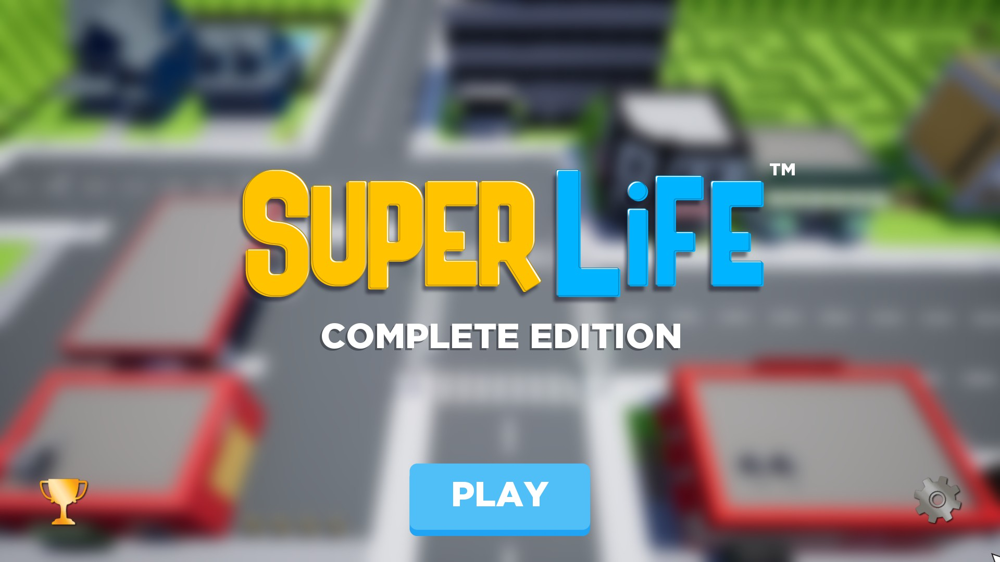

그래서 고른 게임이 이 'Super Life (RPG)'다. 예전에도 언급했듯, 내가 '인생 살아가기' 류의 게임을 좋아하기도 하고, 스팀에서 그걸 알았는지 이 게임을 추천해줬다.

게임의 룰은 간단하다. 마을을 돌아다니고, 일을 하며 돈을 벌고, 사람들과 만나며 퀘스트를 이어나가는 게임이다. 가장 중요한 특징을 말해보자면 역시 **프레스티지(prestige)** 시스템. (타 게임이 그렇듯) 일부 보너스와 재화만 남긴 채 퀘스트 진행, 레벨, 돈, 스탯 등을 초기화해서 다시 플레이하는 방식이다. 프레스티지가 거듭될수록 다음 프레스티지 시점이 빨리 찾아오는 것도 있지만, 첫 회차로는 퀘스트를 다 진행하기가 사실상 불가능하기 때문에 프레스티지는 필수적이다. 관련 업적이 여럿 있기도 하고.

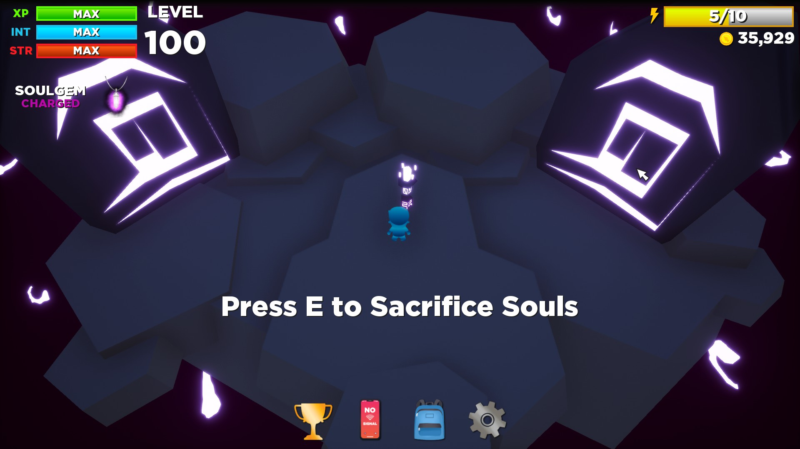
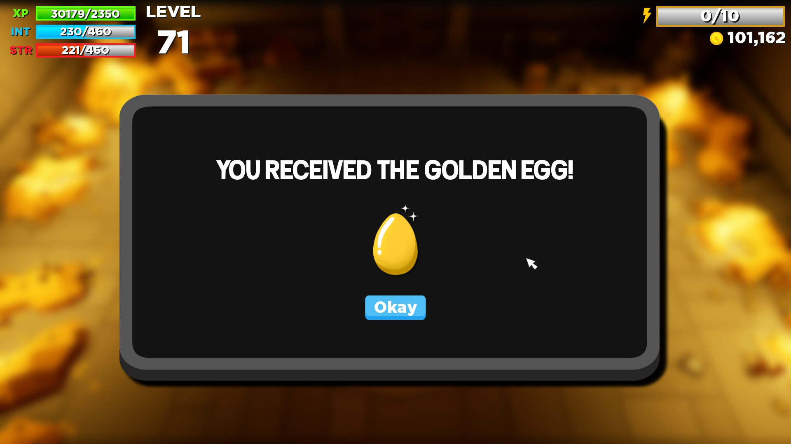

두 번째 특징으론, 공략법을 잘 모르면 게임이 한없이 좁고 작아진다는 점. 최대 레벨을 찍기 위해, 보통 세 개의 주요 마을(Sun villa, Golden springs, Diamond bat)을 거치는데, 스토리 진행을 하지 않으면 정말 이 세 마을만 거치고 끝이 난다. 그래서 처음에 컨텐츠가 많지 않구나- 하고 생각했는데, 프레스티지를 거듭하고 숨겨진 상호작용을 찾을 때마다 스토리와 세계가 점점 확장된다. 다만, 반대로 공략이 없으면 도달은 커녕 존재 자체도 알기 어렵다. 가령 Golden egg를 얻는 업적을 위해 공략을 찾아봤는데, 설명을 보고 식겁을 했다. "이걸 어떻게 알아냈지?" 하는 생각 반, "이걸 안 봤으면 얻는 데 며칠이 걸렸을까?" 하는 생각 반.

그래도 그런만큼, (공략이 있다면야) 세세하게 즐길 수 있는 요소가 많다. 스킨, 시간, 소지품, 진행도에 따라 많은 게 달리지니 하나하나 유심히 살펴보는 재미가 있다. 몇 개만 소개하자면,

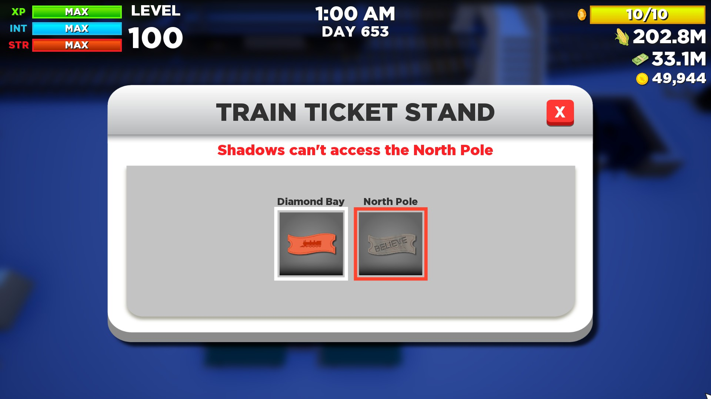

Shadow 스킨을 착용하면 특정 NPC의 영혼을 가져갈 수 있지만, 꿈나라로 갈 수 없고, 산타를 보러 갈 수도 없다.

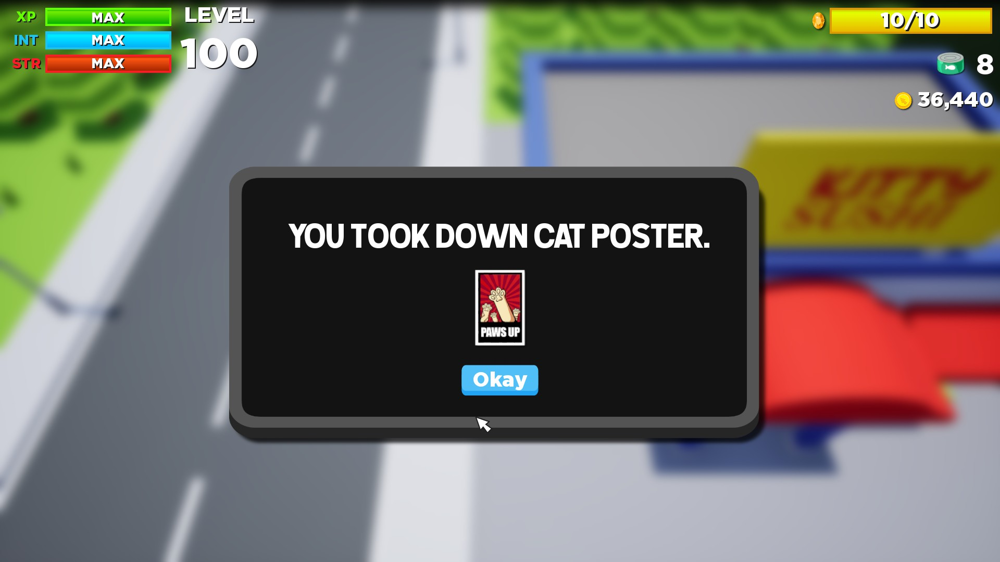

Cat 스킨을 착용하면 오후 9시 Diamond bay 영화관에서 영화 속 세계로 들어가서 고양이들과 상호작용할 수 있다. 여기 스토리가 좀 묘하다.

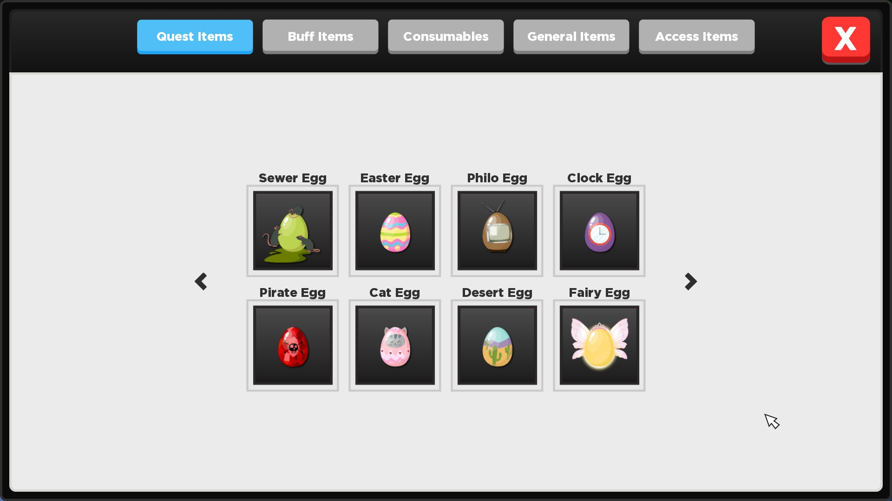
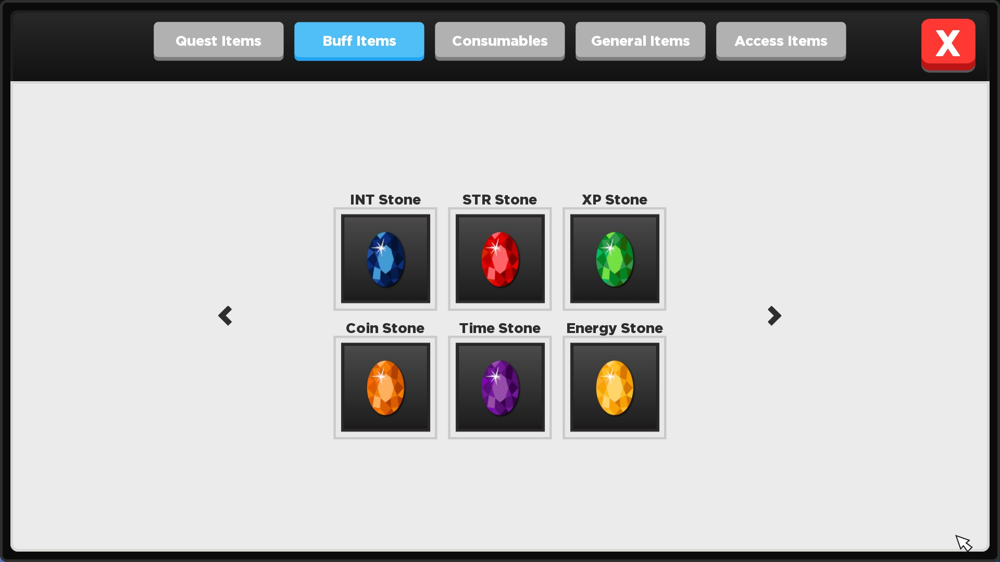

이스터에그와 버프를 제공하는 돌이다. 둘 다 획득을 위해선 굉장히 복잡한 경로를 거치게 된다. 특히, 후자는 복잡한 주제에 저걸 다 얻을 시점에선 최고 레벨을 찍고도 남아서 위 세 돌들은 필요가 없다. 프레스티지 이후에 날아가기도 하고. 공략이 있어도 얻기가 어렵지만, 이걸 얻는 과정에서 많은 새로운 컨텐츠를 거칠 수 있기에 한 번 쯤은 노려보는 걸 추천한다. 관련 업적도 있고.

여기에도 엔딩 루트가 있는데, 엔딩을 보려고 하면 게임이 굉장히 길어진다. 프레스티지를 충분히 쌓고 시도해보는 걸 추천. 나는 6회차에 시도했다가 피를 조금 봤다. 업적을 노린다면 스토리 따로, 에그 따로, 스톤 따로 얻는 게 편할 것이다. 레벨 낭비도 적고.

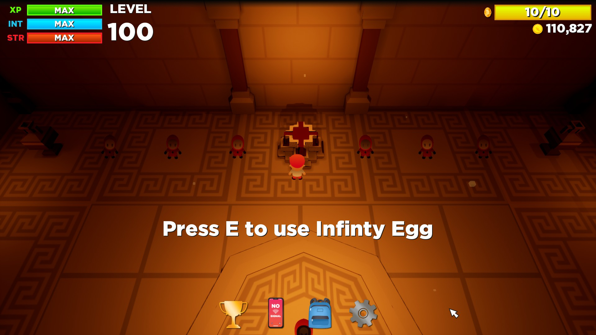

아무튼 끝없는 노가다 끝에 엔딩을 볼 수 있었다. Infinity는 내 노가다를 표현하는 게 아니었을까... 엔딩을 볼 시점에 휴가가 끝나가기도 하고, 파인애플 섬에 다시 가긴 힘들 것 같아서 게임을 마무리했다.

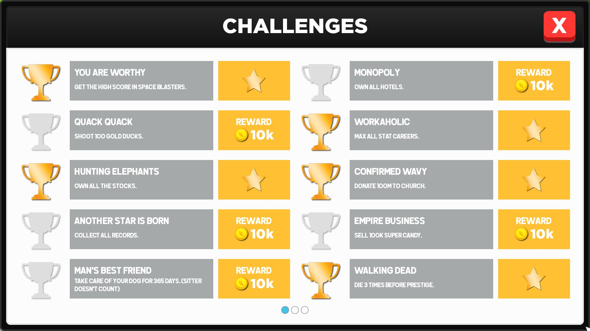
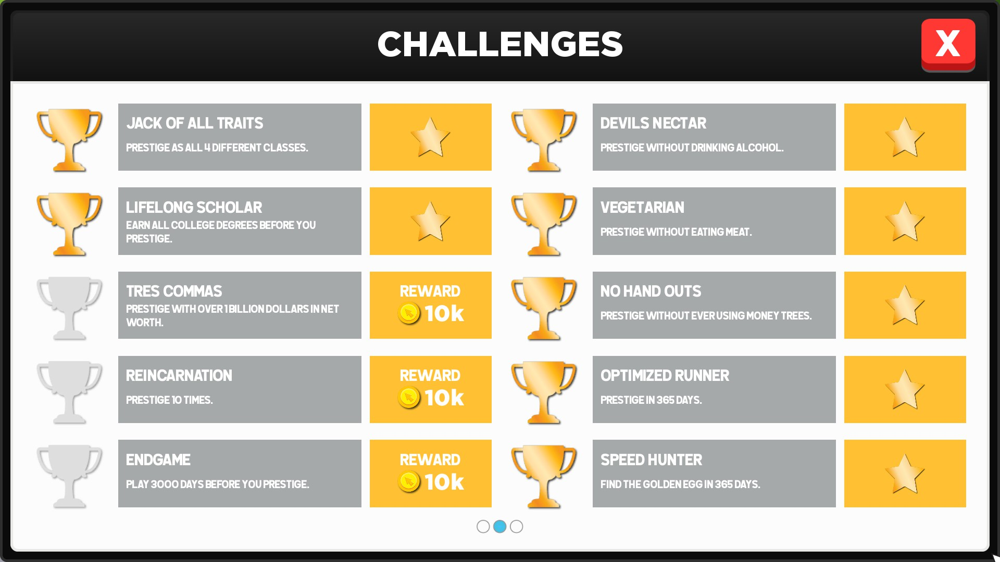
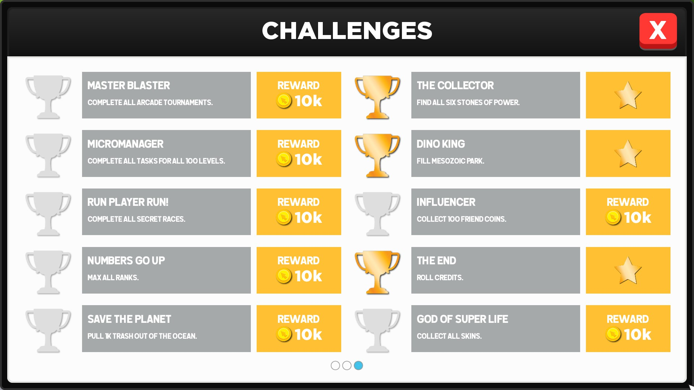

너무 게임이 지루해지지 않을 업적들만 클리어했다. 그렇다고 해도 나름 노력이 많이 들어가긴 했다. 인상 깊었던 업적을 몇 개 꼽아보자면,

- The end: 게임의 엔딩을 봐야 한다. 프레스티지 한 번과는 차원이 다른 난이도이기도 하고, 일단은 스토리의 끝이니 중요한 업적 중 하나. 다만 스토리와 엔딩 자체는 이해가 좀 어렵다.
- Workaholic: 엔딩보다 더 많은 노력이 필요하다. 특히 프레스티지 횟수가 적으면 조금 더 고생해야 한다. 역시 가장 귀찮은 작업은 아마존 짝퉁 기업과 Knight of the pineapples일 것이다. 특히 후자는 최종 레벨이 22인데다, 일도 한 시간 단위로밖에 못해서 손이 조금 아프다. 파인애플 섬에 도달해야 5레벨 이후를 뚫을 수 있는 것도 한 몫 하고.
- Vegetarian / Devils nectar: 육식/음주를 한 번도 하지 않고 프레스티지를 마치면 된다. 잘못 누르면 날아가서 다음 프레스티지를 노려야 하는 업적이지만, 업적 조건이 유지되고 있는 한, 인게임에서 친절하게 육식/음주 기호를 표시해 주어 주의할 수 있다.
- The collector: 6개의 스톤을 모으면 된다. 딱 봐도 알겠지만 인피니티 스톤의 패러디다. 엔딩을 따라가다 보면 스톤을 전부 모을 수 있다.
- Speed hunter: 스토리 상 중요한 아이템 중 하나인 golden egg를 365일 안에 모으는 업적이다. 진행도 복잡하고 미로 뚫기는 연습이 필요하다. 다만 프레스티지를 몇 번 했다면 기간 내에 얻는 것 자체는 어렵지 않다.
- Walking dead: 특정 이벤트에서 사망하게 되는데, 총 세 번 사망하면 된다. 사망이라고 해서 게임이 끝나거나 프레스티지를 하는 건 아니고, 고스트 스킨을 줄 뿐이다. 이 또한 스토리를 진행함과 동시에 신경을 써줘야 클리어할 수 있다.

3-4일 동안, 거의 하루 종일 플레이 했다. 휴가의 대부분을 쓰기도 하고, 이걸 플레이하는 동안 거의 폐인처럼 살았는데, 나름 그럴만한 가치가 있었던 게임이었다.

## 그 외
늘 하던대로 메이플스토리는 열심히 플레이했다. 하루 기본 2재획은 한 것 같다. 레벨도 꽤 오르고(257), 최근에 무릉도 50층을 뚫는 데 성공했다. 다만 종종 느껴지는 공허함은 어쩔 수가 없는 듯. 그렇다고 접을 건 아니지만.

또, 잠깐 Bloons TD 6를 플레이했다. 역시 잘 만든 디펜스 게임은 언제 해도 재미있다. 예전에 쓰던 계정이 날아가서 마음이 조금 아프지만, 게임이 재밌으니 다시 시작해도 괜찮을 것 같다. 다만 요령이 없어서 조금 연습이 필요할 듯. 이지 100 스테이지도 겨우겨우 뚫고 있다...

그리고 휴가 마지막 날에 학교 친구들과 함께 밥을 한 끼 먹었다. 최근에 너무 고립되어 있어서 생활이 조금 망가졌는데, (여행때도 친구들을 만나긴 했지만) 간만에 친구들을 만나서 얘기하니 꽤 즐거웠다. 외로움을 타지 않는 편이지만, 그렇더라도 사람을 만나고 살아야 한다는 걸 종종 느낀다.

## 마치며
게임에 너무 많은 시간을 쏟은 점과, 연구실 일이 자꾸 마음 한켠에 남아 마음이 편하지 않았던 점은 좀 아쉽다. 휴가도 적절한 계획과 마음가짐이 필요한 것 같다. 하지만 그래도 충분히 즐거운 휴가였고, 푹 쉬었으니 내일부턴 다시 열심히 살아야지, 꼭.
