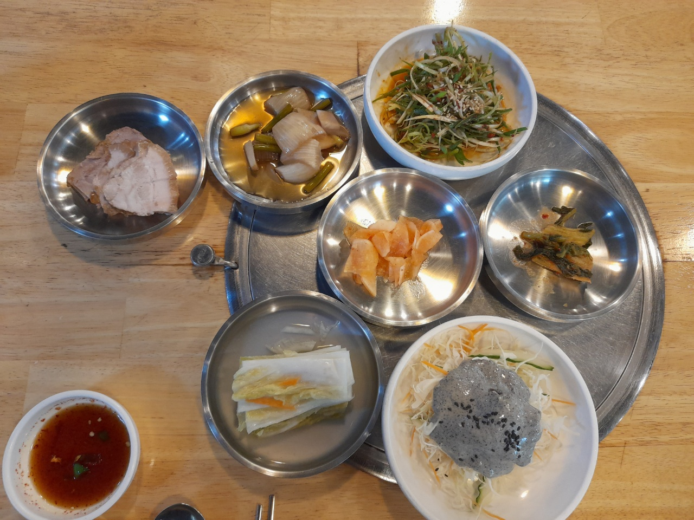
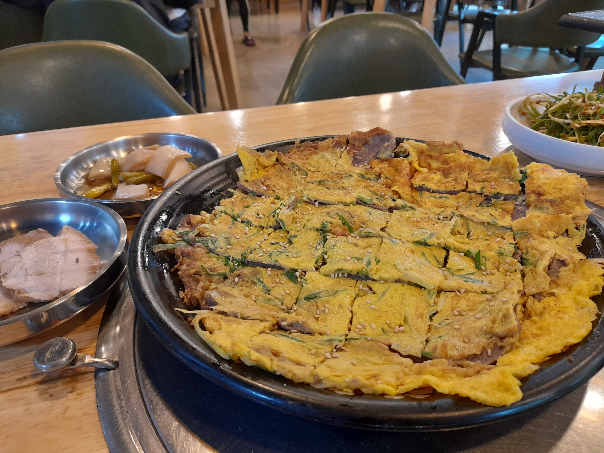
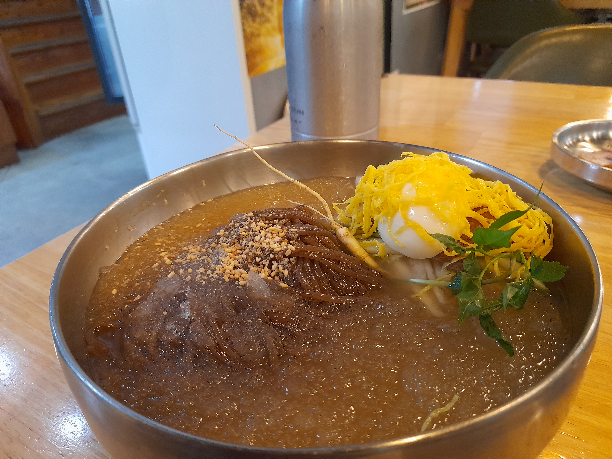
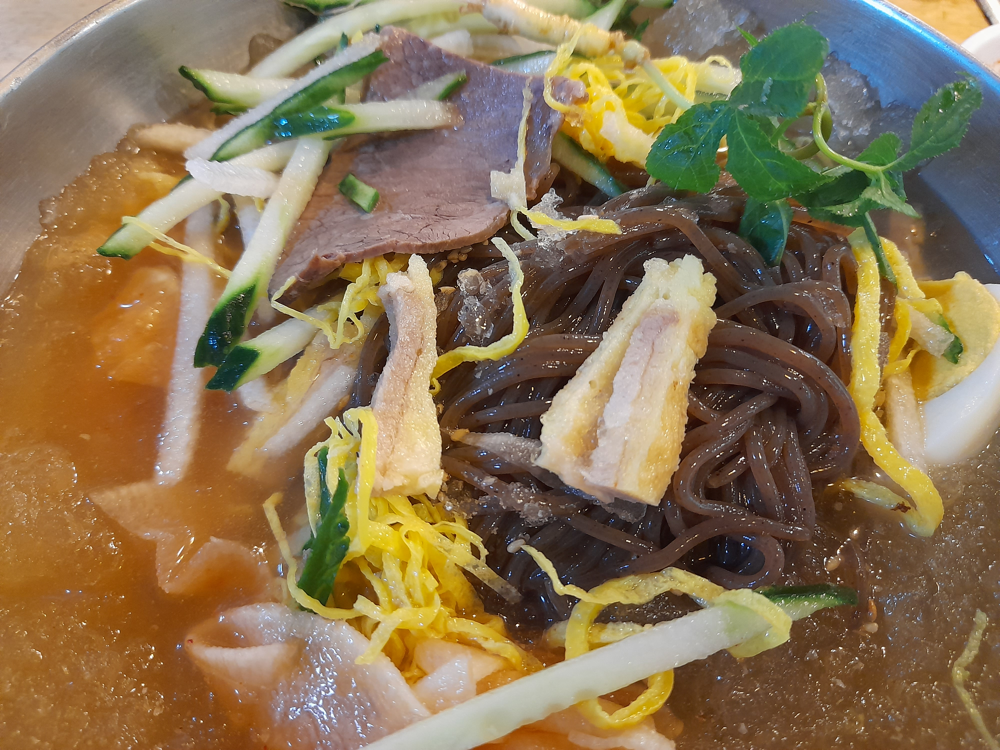

면식을 별로 좋아하지 않는다. 왠지 한 쪽으로 쏠린 영양소도 그렇고, 너무 빨리 먹게 되는 면류의 특성도 있고, 무엇보다도 식후에 남는 그 더부룩함이 너무 싫다. 하지만 그럼에도 새로운 음식이 있다면 한 번은 꼭 먹어보자는 주의라, 경남 진주로 놀러가는 김에 지역 음식 중 하나인 진주냉면을 먹어보기로 했다. 얘길 들어보니 냉면에 육전을 올려서 먹는 음식이라고 한다. 사실 토핑 하나 추가인 셈이지만, 실제로 먹으면 다른 더 가치와 의미가 있을 거라 생각하고 길을 나섰다.

진주에선 '하연옥'이라 불리는 집이 가장 유명한 것 같았다. 친구가 추천해주기도 했고, 규모도 크면서 평도 제법 괜찮아서 여기로 가려 했...으나, 1시간 30분 이상의 대기시간을 듣고 어이가 없어 바로 나왔다. 맛집에 돈은 쓸 수 있지만, 시간은 쓸 수가 없더라. 관광지에서라면 더더욱 그렇고. 택시비를 아까워하며 열심히 대안을 찾아봤는데, 평거동에 위치한 ['진주냉면 본점'](https://jinjoonaengmyeonsg.modoo.at/)이 제법 괜찮아보였다.

나는 물냉면(8,000원)과 육전(20,000) 하나를 주문했다. 혼자 먹는 것 치고 냉면에 커다란 육전까지 올리는 건 좀 과하지 않나 싶지만, 고생은 내 지갑과 살을 뺄 미래의 나만 하니 뭐...

밑반찬이 먼저 나왔다. 반찬으로 수육이 나오다니? 남다른 인심에 감동을 조금 받고 시작했다. 고기가 제법 부드럽고 야들야들해 따로 사 먹고 싶은 마음도 굴뚝같았는데, 다시 보니 메뉴판에 수육은 없었다. 오로지 밑반찬 전용인가보다, 흠. 나머지 반찬은 그냥 어디서나 먹는 듯한 무난한 맛.

뒤이어 육전이 나온다. 갓 구워 따뜻하게 나와서 입 안에서 살살 녹는다. 고기는 어찌나 도톰하던지, 20,000원이 전혀 아깝지 않은 양과 질이었다. 파절이나 간장 양념이 있어 같이 찍어 먹어도 맛있지만, 전 자체가 짭짤하고, 고기와 계란 향을 느끼기 바빠서 거의 생으로만 먹은 듯.

그러다 육전을 절반쯤 해치웠을 때 문득 생각난다, "왜 냉면은 안 나오지?" 그래도 냉면 전문이니 당연히 육수고 뭐고 정성스럽게 준비할 거란 생각은 했지만, 육전 만드느라 내 냉면 주문을 까먹은 게 아닌가 싶기도 했다. 언제 나오는지 물어보기엔 내가 너무 낯을 가리고, 괜히 없어보이게 재촉하는 것 같아 말 없이 육전을 마저 먹었다.

다행히 내 주문은 잘 처리되었고, 큼지막하고 먹음직스러운 냉면 한 그릇이 나왔다. 올려져 있는 쪼그만한 삼같은 녀석이 눈에 띈다. 싸구려 입맛이라 정확히 뭔진 모르겠는데, 적당히 쌉쌀하고 괜찮은 맛이었다.

육전은 살짝 뒤집어주니 보이기 시작했다. 육전이 별로 없는 것 같으면서도, 이상하게 젓가락질을 할 때마다 육전을 집어도 모자라지가 않다. 

면이 도톰하고 쫄깃하니 제법 괜찮았다. 식감이 좋다는 느낌을 조금 넘어서, 입이 즐겁다라는 생각이 들곤 한다. 하지만 그것보다 더 만족스러운 건 역시 육수다. 무엇을 넣었는지 감칠맛이 진하게 올라오면서도, 마시고 마셔도 물리질 않는다. 처음에 국물 맛에 감탄하면서 반 정도를 비우다가, 뭘 넣었는지 알고 싶은 마음에 한 숟가락씩 계속 떠먹다 다 먹어버렸다.

사실 진주 여행은 이게 메인이었고, 가장 처음 일정이었다. 메인 이벤트를 먼저 끝내버리니 딱히 미련이 안 생겨서 나머지는 루즈하게 즐기다가 넘어간 듯. 그럼에도 미련도, 불만족도 하나 없었던 여행이었다. 면식에 대한 마음의 벽이 조금 허물어진 계기가 되었기도 하고.