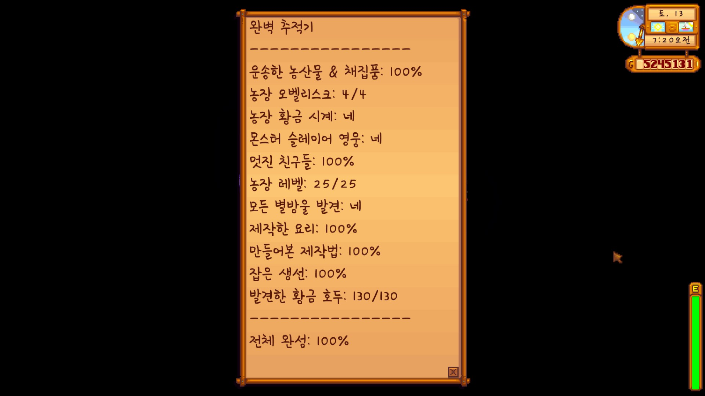
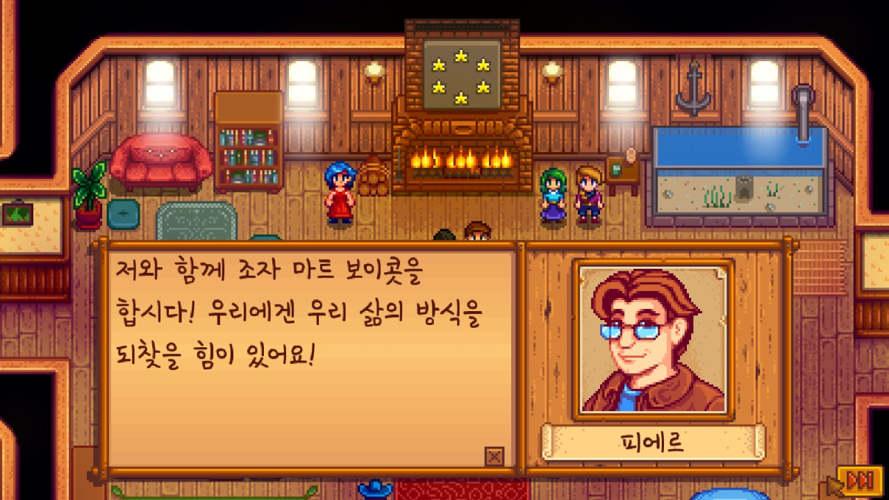
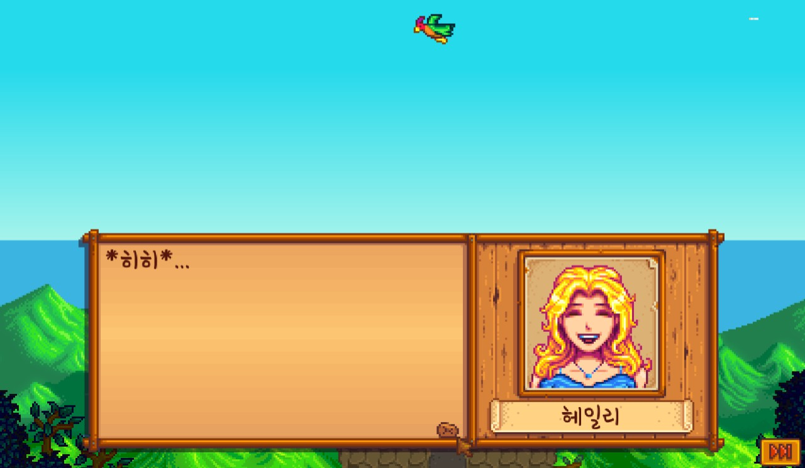
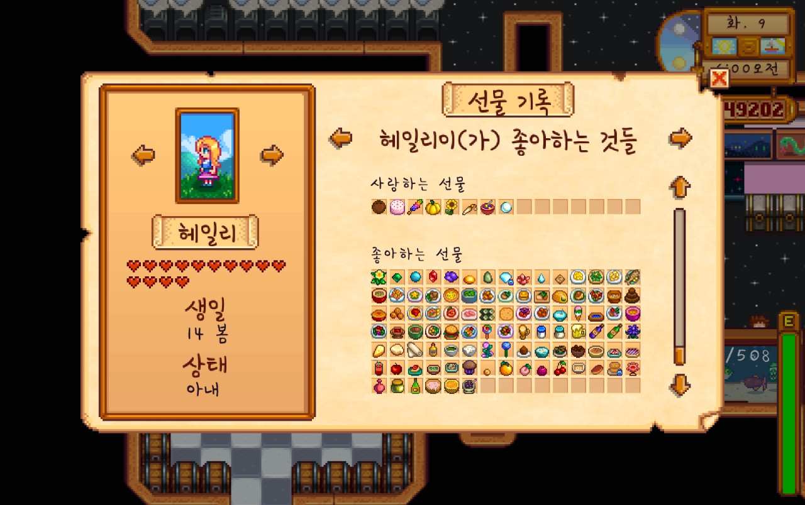
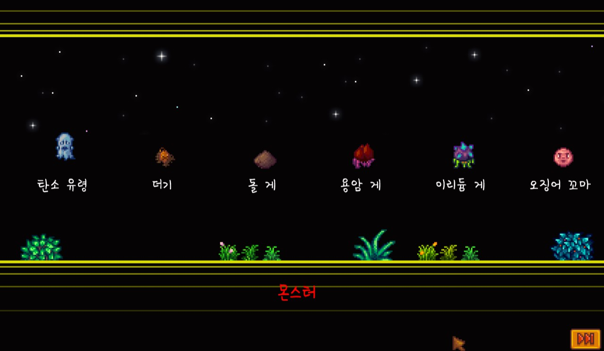
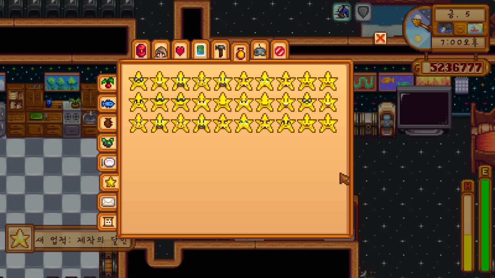

(스포 주의)

내가 좋아하는 요소가 참 많은 게임이다. 인생 시뮬레이션, 농사, 도전 과제, 그리고 노가다. 1.4 버전일 때 몇 달 정도 즐겼다가 접었는데, 1.5 업데이트 이후로 많은 것들이 새로 생겨났고, 데이터와 팁이 충분히 쌓일 정도로 시간이 흘렀기 때문에 부담 없이 새로 시작할 수 있을 것 같았다.

업데이트 이후로 가장 크게 달라진 점은 역시, 엔딩이라 볼 수 있는 이벤트가 생겼다는 점일 것이다. 아무래도 원래 하던 게임이 따로 있고, 나도 여기에 무한정 시간을 쏟을 수는 없기에, 엔딩을 보는 것을 목표로 했다. 사실 많은 게임에서 엔딩이 진짜 엔딩이 아니다. 엔딩을 보고 다른 루트를 타서 다른 엔딩을 본다거나, n번 환생 또는 회귀를 한다거나, 그 이후 노가다와 챌린지들로 업적을 깬다거나... 하지만 여기서의 엔딩은 게임 내 컨텐츠를 거의 정복했을 때 볼 수 있는, 진정한 의미의 엔드 컨텐츠라서 이를 게임의 목표로 잡을 만하다.

엔딩을 보기 위해서는 '완벽'한 상태에 들어와야 한다. 농작물/채집물 배송, 호감도, 요리, 생선, 제작 등을 하나도 빠짐 없이 채워야 하며, 그 외에도 별방울, 황금 호두 등 게임 내 컨텐츠 및 재화를 빠짐 없이 긁어 모아야 한다. 도감이 따로 있는 요리나 생선은 그냥 빈 걸 확인하고 채워나가면 되지만, 제작은 뭘 만들었고, 뭘 만들지 않았는지 확인할 방법이 없어 조금 스트레스다. 엔딩 보기를 시도했을 때 메모장에 메모해가면서 만들었던 걸 생각하면 아직도 가슴이 아프다. 

확실히 엔딩을 안 볼 생각으로 게임하면 꽤 힐링 게임인 편이다. 엔딩을 보려면 모든 걸 채워야 하기 때문에 반드시 보틀넥이 생긴다. 물고기 하나 잡는 걸 까먹어서 다음 해에 다 채운다거나, 소스의 여왕에서 레시피 얻는 걸 깜박해 재방송을 주구장창 보거나 아예 2년 미뤄진다거나... 엔딩을 보기 위해 채워야 하는 게 많다보니, 초중반엔 너무 정신이 없고, 후반엔 비어있는 걸 채우기 위해 노가다의 현장에 들어가야 한다. 나는 마지막 화석을 하나 캐지 못해서 엔딩을 1년 반 정도 늦추게 되었다. 그 동안은 잠-유물 확인-쌍욕-잠을 반복한 듯.

이렇게 말은 했지만, 그래도 엔딩에 확실히 다가가면서, 게임 내의 많은 컨텐츠를 즐기는 건 이 게임의 분명한 매력이다. 요소 하나하나가 완성도있게 잘 만들어져서, 억지로 무언가를 채운다는 생각은 잘 들지 않는다. 어느 게임에서나 광부같은 포지션을 좋아하던 나지만, 열 내면서 낚시 미니게임을 하는 것도, 나무 통통 거리는 소리를 들으며 나무를 베는 일도, 호감도 작을 하면서 각종 이벤트를 보는 일도 제법 즐길 수 있었다. 인생 시뮬레이션 류 게임의 매력을 잘 살린 것 같다.

기억나는 씬 몇 개만 꼽아보자면,

조자 마트 보이콧은 언제 봐도 내 정서론 잘 납득이 가질 않는다... 피에르가 혐사꾼인 것도 한 몫 할지도. 여유가 있으면 조자 마트 살리는 쪽으로도 해볼까 싶었지만, 이젠 너무 늦어버렸다...

엔딩은 헤일리와 함께 봤다. 진성 바닐라 빌런인데, 바닐라여도 고우셔서 열심히 꼬셨다. 처음에 비해 델타가 가장 큰 캐릭터 중 한명인 것 같다. 

(무수한 구애의 흔적)

엔딩 장면 중 일부인데, 나는 저 오징어 꼬마라는 작명의 이유가 너무나도 궁금했다. 처음에 퀘스트로 오징어 꼬마를 잡아오라고 할 때 벙쪘던 게 생각난다. 오징어 먹물을 드랍하는 거 보면 오징어가 맞는 듯 한데, 왜 저게 오징어일까...

업적충인 나로선 가장 기쁜 순간이었다. 특히 제작은 많은 고생을 했는데, 뭘 제작하지 않았는지 몰라서, 그리고 그걸 자꾸 까먹어서 세 바퀴는 돌려가며 모든 아이템을 만들려고 시도했다. 제작도 유물이나 생선, 요리마냥 만들었던 걸 확인할 수 있게 해줬으면 하는 바람이다. 난 이미 끝나서 안 해줘도 상관 없지만~

며칠 동안 정말 열심히 플레이해서, 만족스럽게 끝내고, 미련 없이 지웠다. 내게 좋은 기억으로 남을 게임이다.